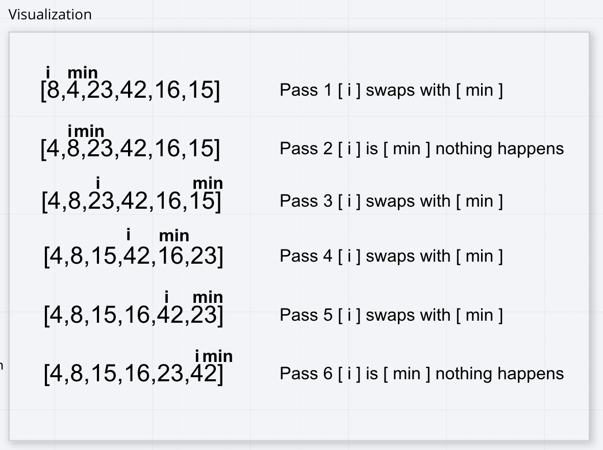

# Insertion Sort

Uses a nested array to iterate through an array finding a value that is **less** than the index before it with each itteration of [i].

Once [j] finds a **smaller** value than [i] it brings that [j] index to where [i] was then starts the process again with [i] being on the next index.

*Here is a visualazition of the process with each pass of [i]*

