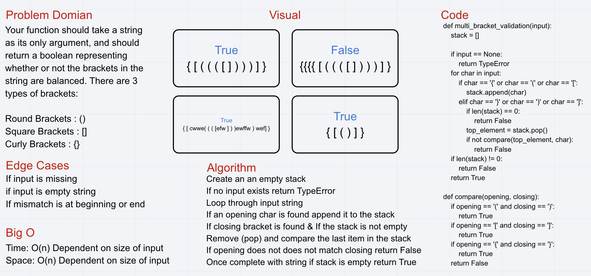

#Is Anagram

## Challenge Description
1. Actual code is required for a complete answer
2. Ask the candidate to write a function to validate whether or not two given strings are anagrams (contain the same letters).
3. Disregard spaces
4. Help the candidate understand the definition of a anagram if they are unsure of it.
    a. Two strings are anagrams if one can be built from exactly the same letters as the other.
5. Avoid utilizing any of the 6. built-in methods available in your language.
6. This problem can be solved using different approaches:
    a. Look at each letter in the first string, and determine if it’s in the second string (removing it, if found).
        1. This is an O(n^2) brute-force solution
    b. Sort the characters in each string, and then see if they are equal.
        1. Best sorts are O(n log n), so this won’t be better than that.
    c. Use a hash to count the occurances of each charater in the first string, and ensure the second string matches.
        1. This requires a single pass through both strings, so at worst is O(n).

## Approach & Efficiency
O(n log n)

## Solution

