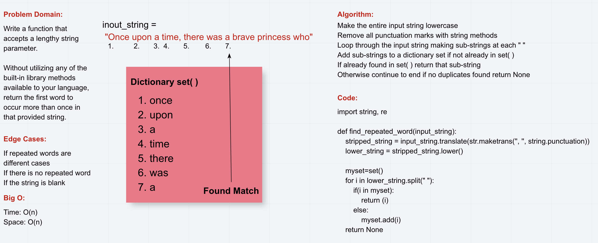

# Challenge Summary

Find the first repeated word in a book.

## Challenge Description

Write a function that accepts a lengthy string parameter.
Without utilizing any of the built-in library methods available to your language, return the first word to occur more than once in that provided string.

## Approach & Efficiency

I used a set to add words to a dictionary after converting them to lower case.
While inside the loop it checks to see if it is present if it is return that word other wise add it to the set.
I believe the efficiency of both time and space is 0(n) because i only loop through until a duplicate is found and the input is variable.

## Solution

