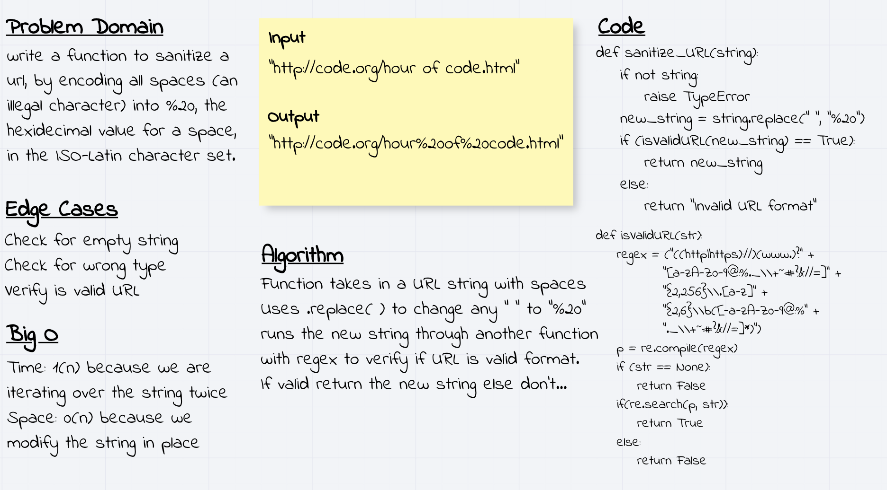

# Sanitize URL

## Challenge
​write a function to sanitize a url, by encoding all spaces (an illegal character) into %20, the hexidecimal value for a space, in the ISO-Latin character set.

## Approach & Efficiency
Function takes in a URL string with spaces

Uses .replace( ) to change any " " to "%20"

runs the new string through another function

with regex to verify if URL is valid format.

If valid return the new string else don't...

## Solution

