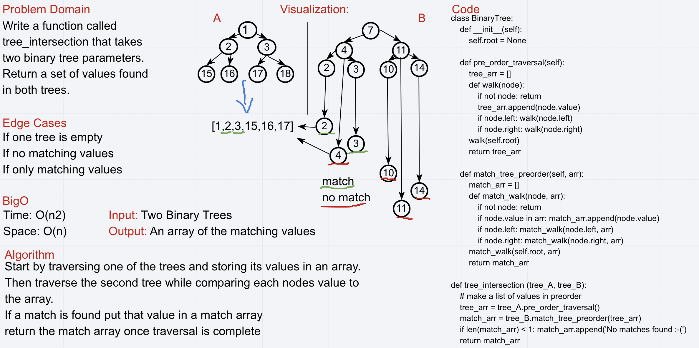

# Tree Intersection

## Challenge Description
Write a function called tree_intersection that takes two binary tree parameters.
Without utilizing any of the built-in library methods available to your language, return a set of values found in both trees.

## Approach & Efficiency
​Start by traversing one of the trees and storing its values in an array.

Then traverse the second tree while comparing each nodes value to the array.

If a match is found put that value in a match array

return the match array once traversal is complete
## Solution

